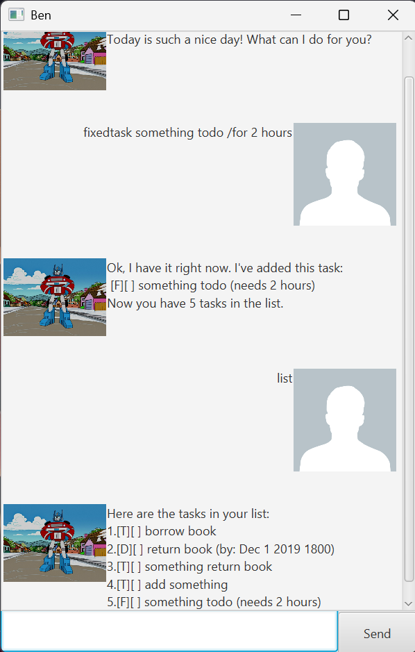

# Ben User Guide



**Ben** is your personal chatbot that will help you manage tasks to do with a personality.

## Listing all tasks

List all tasks in the task list.

There is only one variant of the command which is shown below.

Example: `list`

**Ben** should show all tasks currently in the task list.

```
Here are the tasks in your list:
1.[T][] [task description]
2.[D][] [task description] (by: [deadline])
...
```

## Adding todo tasks

Add todo tasks that only consists of a description.

An example of this is a simple task such as opening a book.

Example: `todo open a book`

**Ben** should add the todo task into the task list and display the following message.

```
Ok, I have it right not. I've added this task:
 [T][] open a book
Now you have [number of tasks + 1] tasks in the list.
```

## Adding deadline tasks

Add deadline tasks that consists of a description and a deadline time.

An example of this is doing homework with a deadline time of 2 December 2019 at 6 PM.

Example: `deadline do homework /by 2019-12-02 1800`

**Ben** should add the deadline task into the task list and display the following message.

```
Ok, I have it right not. I've added this task:
 [D][] do homework (by: Dec 2 2019 1800)
Now you have [number of tasks + 1] tasks in the list.
```

## Adding event tasks

Add event tasks that consists of a description, start time and end time.

An example of this is going to an event with a start time of 2 December 2019 at 2 PM and end time of 2 December 2019 at 4 PM.

Example: `event go to event /from 2019-12-02 1400 /to 2019-12-02 1600`

**Ben** should add the event task into the task list and display the following message.

```
Ok, I have it right not. I've added this task:
 [E][] go to event (from: Dec 2 2019 1400 to: Dec 2 2019 1600)
Now you have [number of tasks + 1] tasks in the list.
```

## Adding fixed time tasks

Add fixed time tasks that consists of a description and a duration of time to complete it.

An example of this is running on the threadmill with a duration of 2 hours.

Example: `fixedtask run on the threadmill /for 2 hours`

**Ben** should add the event task into the task list and display the following message.

```
Ok, I have it right not. I've added this task:
 [F][] run on the threadmill (needs 2 hours)
Now you have [number of tasks + 1] tasks in the list.
```

## Deleting tasks

Remove any task from task list as long as the index of the task is given.

An example of this is when the user does not want to see the todo task of doing homework at index 1 anymore.

Example: `delete 1`

The task should be removed from the tasklist that is displayed when running the `list` command.

```
Noted. I've removed this task:
  [T][] do homework
Now you have [number of tasks - 1] tasks in the list.
```

## Finding tasks

Find tasks whose description contains the query string.

An example of this is when the user wants to find all tasks whose description contains the string "school homework".

Example: `find school homework`

**Ben** should show all tasks whose description contains the query string "school homework".

```
Here are the matching tasks in your list.
1.[T][] do biology school homework
2.[D][] do chemistry school homework about molecules (by: Dec 1 2019 1800)
...
```

## Marking tasks as done

Mark any task as done and be shown as such by **Ben** as long as the index of the task is given.

An example of this is when the todo task of doing homework at index 1 is done and should be marked.

Example: `mark 1`

**Ben** should mark this task as done in the task list and display the following message.

```
Nice, I've marked this task as done:
  [T][X] do homework
```

## Unmarking tasks as done

Mark any task that was previously marked as done to be unmarked (marked as not done) as long as the index of the task is given.

An example of this is when the todo task of doing homework at index 1 should be marked not done.

Example: `unmark 1`

**Ben** should mark this task as not done yet in the task list and display the following message.

```
Ok, I've marked this task as done yet:
  [T][] do homework
```

## Saying bye to **Ben**

**Ben** sends a goodbye message to the user.

An example of this is when the user wants to leave.

Example: `bye`

**Ben** should send a goodbye message to the user.

```
Bye. Hope to see you again soon!
```